```{r setup, include = FALSE}
knitr::opts_chunk$set(
  echo      = FALSE,
  warning   = FALSE,
  message   = FALSE,
  error     = FALSE,
  cache     = FALSE,
  fig.path  = "../figs/",
  fig.align = "center",
  out.width = "80%")

library(kableExtra)
library(dplyr)
library(readr)
library(lubridate)

```

```{=tex}
\parskip=12pt 
\newpage
\setcounter{page}{1}
\linenumbers
```
# ABSTRACT {.unnumbered}

It can be challenging to distinguish management impacts from other population drivers, including 'natural' processes and co-occurring threats. However, disentangling processes is important, particularly when management may have unintended consequences, such as mesopredator release. We explored the effects of long-term, broadscale poison-baiting programs on the distribution of red foxes *Vulpes vulpes* (targeted invasive predator), feral cats *Felis catus* (unmanaged invasive competitor) and two of their threatened native prey in two fire-affected regions of south-eastern Australia. We synthesised data from 3,667 camera-trap deployments at 1,232 sites (172,052 trap-nights), combining experimental manipulation of foxes and fire with space-for-time approaches. Fox control effectiveness---in terms of decreased probability of fox occurrence and increased probability of prey occurrence---depended on the duration and intensity of the poison-baiting program. The effects of fox control on prey occurrence also varied between the two native prey species: fox control was strongly beneficial to the long-nosed potoroo *Potorous tridactylus* but had no measurable effect on southern brown bandicoot *Isoodon obesulus* occurrence. Feral cat occupancy tended to be higher in landscapes with long-term fox control, although we found no effect of fox-bait density on fine-scale cat occurrence. Time since fire (0 -- 80 years) was associated with the occurrence of each study species, but its association with invasive predators also differed among vegetation types. Invasive predators and altered fire regimes are key, often overlapping, biodiversity threats. Our work highlights the importance of fine-scale monitoring and consideration of multiple drivers in distribution models to develop effective, tailored conservation strategies.

\newpage

# INTRODUCTION

Accurate and precise estimates of the effects of management are essential to inform conservation decision-making, ensure cost-effective allocation of resources and help identify potential unintended consequences of management interventions [@christie2020poor]. However, reliable inference about the effects of landscape-scale management, including the cause of nil or perverse outcomes, is often difficult to achieve because target populations fluctuate naturally and are often subject to multiple co-occurring threats and management actions [@pressey2007conservation; @sugihara2012detecting]. Separating management effects from other drivers is particularly difficult for species that occur patchily across broad distributions [@tulloch2016using].

Invasive predator management is a prime example of these challenges. Predators can have devastating impacts on native biodiversity when introduced beyond their native range, and so invasive predators are often lethally controlled [@bellard2016global; @doherty2016invasive; @sih2010predator]. Quantifying the degree of invasive predator suppression, the responses of their native prey and any unintended outcomes across gradients of predator control is key to designing cost-effective management programs [@walsh2012unexpected; @baxter2008cost; @cattarino2016accounting]. However, the ability of associated monitoring programs to detect these signals is often confounded by co-occurring threats, management actions and natural drivers. This is concerning because few benefits, or even negative effects, for native biodiversity are commonly observed following invasive predator control, particularly when multiple introduced species are present [@ballari2016potential].

There are several reasons why native prey species may not benefit from invasive predator control. Firstly, control efforts may not sufficiently reduce the density of invasive predators---predators can be resilient to low-effort culling [@moseby2019understanding; @lieury2015compensatory]. Secondly, invasive predator suppression may lead to 'release' of a subordinate predator or competitor species [referred to as the 'mesopredator release hypothesis' @crooks1999mesopredator], which could potentially worsen net outcomes for native species [@doherty2017stop]. Thirdly, predation by introduced species may not be the primary limit on native prey populations [@banks1999predation]. Hence, quantifying the degree of dominant predator suppression and testing the mesopredator release hypothesis [@crooks1999mesopredator] are important steps toward understanding prey responses to lethal predator control and identifying the cause of a nil response, if observed [@salo2010predator].

The effects of invasive predator control on native prey may also be obscured or influenced by other concurrent processes. For example, fire is a key driver of species distributions in many terrestrial ecosystems [@he2019fire]. Fire can mediate predator-prey interactions (primarily through its effects on vegetation structure), and its effects may be long-lasting, non-linear and vary across environmental conditions [@monamy2000small; @hradsky2020conserving; @haslem2011habitat]. Fauna species' responses to fire therefore often vary across heterogeneous landscapes [@swan2015predicting; @nimmo2014why]. Likewise, other disturbance processes such as habitat fragmentation, as well as natural drivers such as vegetation type, terrain ruggedness and rainfall dynamics, play an important role in shaping the contemporary distribution of many predator and prey species [@may1996influence; @hale2016fire]. Simultaneously accounting for the influence of these drivers is likely to improve our understanding of predator control outcomes, including potential invasive mesopredator release.

Here we investigated the effect of landscape-scale lethal management of introduced red foxes *Vulpes vulpes* (hereafter 'foxes') on the occupancy of foxes (the managed invasive species), feral cats *Felis catus* (an unmanaged invasive competitor; hereafter 'cats'), and two threatened native prey species: the southern brown bandicoot *Isoodon obesulus* (hereafter 'SBB') and long-nosed potoroo *Potorous tridactylus* (hereafter 'LNP'). Our study was conducted across two large, protected, fire-prone conservation regions of south-eastern Australia (the Glenelg region and Otway Ranges) and combined experimental and space-for-time approaches. We tested whether poison baiting was effective; that is, whether the density of poison fox-baits was negatively associated with the probability of fox occurrence and positively associated with SBB and LNP occurrence. In line with the mesopredator release hypothesis, we also tested whether bait density was positively associated with cat occurrence. Given that fox control has occurred over a longer period and baits are replaced more frequently in the Glenelg region than the Otway region, we predicted that these effects would be stronger in Glenelg. We examined these relationships while statistically accounting for the effects of other drivers, including time-since fire, distance from forest edge (a proxy for habitat fragmentation), vegetation type and topographic position. Our analysis allowed us to include non-linear effects and identify the relative importance of these different drivers for each species' distribution.

\newpage

# MATERIALS AND METHODS

## Study design

We compiled data from multiple camera-trap studies across two regions in south-west Victoria, Australia: the Glenelg region and Otway Ranges (Fig. \@ref(fig:occ-map)). Introduced foxes and cats are the only functional medium-large mammalian terrestrial carnivores here: native dingoes *Canis familiaris* are long-absent throughout, while spotted-tailed quolls *Dasyurus maculatus* are long-absent in the Glenelg region and likely functionally extinct in the Otway Ranges (last confirmed sighting in 2014). Managers frequently implement prescribed fire across both regions, primarily to reduce fuel loads.

In broad sections of each region, government land managers conduct ongoing targeted lethal fox control for biodiversity conservation. Manufactured poison-baits ('FoxOff', Animal Control Technologies, Somerton) containing 3 mg of sodium fluoroacetate (compound 1080) are buried at a depth of 12 - 15 cm at 1-km intervals along accessible forest tracks and roads. Different road densities therefore result in spatially-variable densities of poison-baits.

In the Glenelg region, three distinct forest blocks have been subject to poison-baiting since October 2005, with baits replaced at fortnightly intervals. These forest blocks, along with three similar, unbaited forest blocks to the north have been simultaneously surveyed annually under the 'Glenelg Ark' fox control program since 2013, with 40 camera-trap sites per block [@robley2020glenelg]. Here we used camera-trap data from 2013 to 2019. We also included a further 425 camera-trap deployments at unique locations from early 2018 (209 across two baited blocks, 206 across two unbaited blocks; M.W.R, PhD surveys). This totals 2,041 camera-trap deployments in the Glenelg region, collected in a control-impact experimental design (Supporting Information Table \@ref(tab:cam-stats-glenelg)). Foxes had been continuously controlled for 8 - 14 years in the treatment landscapes at the time of these surveys.

In the Otway Ranges, fox-baiting commenced in small sections of the range in 2008. Large-scale systematic baiting began in 2016 - 2017 under the 'Otway Ark' program [@robley2019otway]. For the first six weeks of the Otway Ark program, poison-baits were replaced weekly, this then changed to ongoing monthly bait-replacement. There was a pause in baiting for approximately six months during the second half of 2018. Fox control recommenced in late 2018 with four weeks of fortnightly bait-replacement, before returning to monthly bait-replacement. A large section of the Otway Ranges to the north-west remains unbaited as it is a known stronghold for native prey species, and so the need for fox control was not justified [but remains monitored as part of the Otway Ark program, @robley2019otway]. The Otway Ark land-managers survey 372 camera-trap sites annually (sequentially across the region), with at least one 'before' baiting survey, totalling 1,113 camera-trap deployments between 2016 and 2018 [@robley2019otway]. We also include data from additional before-after control-impact surveys (one 'before' baiting survey and two 'after' bating surveys) in the western section of the Otway Ranges, conducted annually 2017 - 2019 (M.W.R PhD surveys). This added a further 195 sites and 524 camera-trap deployments (Supporting Information Table \@ref(tab:cam-stats-otways)).

All camera-trap deployments consisted of a Reconyx (Holmen, Wisconsin) brand camera-trap (white or infrared flash), attached to a tree or a metal picket, facing a lure. The Glenelg Ark and Otway Ark fox monitoring programs positioned camera-traps at least 40 cm above the ground on a tree or a metal picket, angled downwards toward a lure approximately 1 - 1.5 m away [@robley2020glenelg; @robley2019otway]. A GPS was used to ensure the camera-trap was placed in approximately the same site each year. The lure consisted of peanut butter, golden syrup and rolled oats mixed into a small ball, placed within a tea strainer or PVC pipe container and secured either to the ground, or 20 - 60 cm above ground on a wooden stake. The M.W.R PhD surveys across both regions positioned camera-traps lower on a tree (around 15 - 30 cm above the ground) angled only slightly downwards towards a tuna oil lure approximately 2 - 2.5 m away [detailed in @rees2023mesopredator]. Camera-traps were active for an average of 47 days (maximum 93 days), totalling 172,052 trap-nights. Camera-traps that were active for fewer than ten days were discarded from the dataset.

## Study landscapes

In the Glenelg region (38°05'54"S 141°44'41"E), large patches of natural vegetation are fragmented, mostly by pastoral farming and residential properties (Fig. \@ref(fig:occ-map)). Here, the primary vegetation communities are heathy woodland, lowland forest, herb-rich woodland and wet heathland [@delwp2020bioregions]. The Glenelg region has an annual mean minimum temperature of 8 °C in winter, and 20 °C in summer, and a mean maximum temperature of 14 °C in winter, and 22 °C in summer [@BOM2021, Portland Airport]. The mean annual rainfall is 835 mm [@BOM2021, Portland Airport]. Terrain is gently undulating in the Glenelg region; study sites ranged from 12 - 180 m above sea level.

The Otway Ranges (38°57'82"S 141°68'41"E) is a largely continuous patch of natural vegetation with a strong east-west rainfall gradient (Fig. \@ref(fig:occ-map)). A matrix of cool temperate rainforest and wet forest at high-altitudes in the south-west descend into a large heathland directly north, and into dry forests and then heathlands to the north-east. Annual rainfall averages 1955 mm in the southwest, dropping to 627 mm in the eastern Otways [@BOM2021, Cape Otway]. Mean minimum temperatures in the Otway Ranges are 8° in winter and 13° in summer, and a mean maximum temperature of 14 °C in winter, and 21 °C in summer [@BOM2021, Cape Otway]. Our study sites ranged from 23 - 617 m above sea level.

We identified the Ecological Vegetation Class group [standard units for vegetation classification in Victoria, @delwp2020bioregions - hereafter 'vegetation type'] for each unique camera-trap site. There were eight vegetation types in total. However, we only surveyed 20 unique sites in rainforests, which are interspersed (primarily in low lying gullies) throughout wet and damp forests in the south-eastern Otway Ranges. Given the similarity, fine-scale interspersion of these vegetation types, and that both rarely or never experience fire, we merged them together (hereafter referred to as 'wet forests').

## Occupancy-detection models

We first modelled species occupancy probabilities using occupancy-detection models [@mackenzie2002estimating] implemented in a Bayesian framework using 'stan' [@carpenter2017stan] via the 'ubms' R-package [version 1.0.2, @ubms]. For each species, we fit a 'stacked' single-season model: we included a random intercept for each unique camera-site to account for repeat sampling [@kery2020applied]. We defined survey occasions as 24-hour periods commencing at midday. We modelled the effect of fox control (categorical: baited or unbaited) on species occupancy and detectability, and included an interaction term with region to account for potentially different responses in the Glenelg and Otway regions. We also included the effect of vegetation type on occupancy (see Section 2.2), as well as lure type (peanut butter or tuna oil) on detectability. We fit models with uninformative priors, with four MCMC chains each with 10,000 iterations (including a 5000-iteration warm-up phase). To determine whether species' detection probabilities were high enough to permit analysis with generalised additive models (which do not account for imperfect detection), we calculated cumulative detection probabilities for camera-trap survey lengths [@garrard2008when] from one to 93 days (maximum survey duration).

## Generalised Additive Models

The occupancy-detection models revealed high (\> 75%) cumulative detection probabilities for each species in both baited and unbaited landscapes for each region, and for both camera-trap lure types, based on our average camera-trap survey effort, except for cats in the Glenelg region (see results for details). We therefore went on to model species occurrence probabilities (using the raw presence-absence data) with binomial GAMs implemented in the 'mgcv' R-package [@wood2017generalized]. The use of GAMS has the advantage of allowing modelling of non-parametric and nonlinear relationships between response (species occurrence) and explanatory variables in a computationally efficient framework. This is particularly important for estimating the responses to time since fire (in years; hereafter 'TSF') [@haslem2011habitat] .

The response variable in the GAMs was binary occupied-unoccupied for each species for the entire camera-trap deployment at a site in a year. To account for differences in survey duration at different sites and years, we specified a model offset for the log-transformed survey duration (number of days). We accounted for pseudoreplication from repeatedly surveying the same site in multiple years by including a random-intercept for each unique site. We used the double penalty model selection approach, which penalises model complexity both in terms of the model structure (which explanatory variables are included) and the shape (wiggliness) of the relationships between the response and explanatory variables [@marra2011practical]. We used the same model structure for each species, as detailed in the sections below. We assessed model fit and predictive performance measures (proportion of the null deviance explained, adjusted R-squared value and Akaike Information Criterion; hereafter 'AIC') score against a 'null model' for each species which only had a random intercept for each came

### 1080 poison-bait density

Poison-baits are deployed by land managers to suppress foxes with the aim of benefiting native prey. The degree of fox suppression is likely to be a function of the spatial arrangement of poison-baits (i.e., poison-bait density) relative to fox home-range size, as well as the frequency of bait replacement [@fleming1996ground; @benshemesh2020citizen]. In the Otway and Glenelg regions, adult foxes travel an average maximum distance of 2.3 km from their home-range centre [@hradsky2017human]. Therefore, to examine the typical lethal control effort experienced by a fox in these landscapes, we summed the number of poison-bait stations within a 2.3 km radius around each camera-trap deployment. Bait densities ranged from 0 - 19 baits per 16.1 km^2^ circle (2.3 km radius), with a mean value of 10 and eight baits per circle in fox-baited landscapes in the Glenelg region and Otway Ranges, respectively. For ease of comparison with other studies, we converted these values to baits per square kilometre. We modelled a function of 1080 poison-bait density with separate responses for each region. Interpretation of these relationships should keep in mind that they are context-specific and conservative: they do not account for the fact that (i) in wet weather conditions, some poison-baits deteriorate and become unavailable to foxes and these baits do not get replaced, or (ii) there was an approximately six month pause in bait replacements in the Otway Ranges in 2018, or (iii) there are differences in baiting frequency between the regions.

### Fire and vegetation type

We expected species occurrence to (i) differ across vegetation types, (ii) respond to TSF, and (iii) have variable responses to TSF in each vegetation type [as post-fire regeneration occurs at different speeds, @swan2015predicting]. We also expected species to respond to fire frequency, as this can have a strong effect on vegetation structure [@collins2012can].

We derived fire frequency (the number of previous fires) and time since last fire (in years) for each camera trap deployment using coarse fire scar mapping provided by government managers, dating back to 1939 when large wildfires burnt both regions extensively. On average, sites for each camera-trap deployment had been burnt 1.5 times since 1939 at the time of camera deployment. The most frequently burnt sites (two deployments at different unique sites) had experienced eight fires; 397 camera-trap deployments (11%) had not burnt since 1939.

We modelled an interaction between TSF and vegetation type (see Section 2.2) by using a hierarchical model structure, which estimated an average TSF response for each species, along with separate responses to TSF in each vegetation type [model 'GS' detailed in @pedersen2019hierarchical]. This approach shares information on TSF responses and wiggliness across vegetation types, penalising functions which deviate strongly from the average response that are not substantially supported by the observation data. We initially fit a separate smooth for fire frequency, however, this had high concurvity with TSF (causing a lack of identifiability) and so we removed the fire frequency variable from all models.

### Elevation, topographic ruggedness and wetness

Elevation is a strong driver of rainfall, moisture and temperature gradients in both regions, likely indirectly impacting the distribution of the study species through resource availability. High topographic complexity (i.e., 'ruggedness') can limit predator movement and predation rates, thereby benefiting prey [@hohnen2016occupancy; @stobo2020habitat; @mckenzie2007analysis; @mcdonald2017habitat]. Soil moisture (estimated by the topographic wetness index) impacts vegetation, as well as the availability of subterranean invertebrates and fungi - key food sources for LNPs and SBBs [@lobert1990home; @nuske2017redundancy].

We extracted the elevation above sea level (metres) of each site using a 10-m resolution digital elevation model [@delwp2020elevation]. We also used this elevation layer to calculate the median terrain ruggedness index [calculates the difference in elevation between a central cell and eight adjacent cells, @riley1999index], taking the median value in a 30-m radius around each camera-trap site. The topographic wetness index estimates where water will accumulate by accounting for topographic influences on hydrological processes [@beven1979physically]. We also took the median topographic wetness index in a 30-m radius around each camera-trap site, derived from a 30-m resolution layer [@gallant2012topographic]. We modelled the effect of elevation, as well as indices of topographic ruggedness and wetness (both derived from a digital elevation model) on species occurrences.

### Proximity to forest edge

Invasive predators are well-documented to prefer edges between forest and cleared land as they facilitate efficient movement and hunting [e.g., @mcgregor2014landscape; @hradsky2017human; @nichols2019evaluation]. We modelled the effect of the minimum distance from each camera-trap site to the nearest substantial area of non-native vegetation. We calculated this by inverting the extent of native vegetation [@NV2005_EVCBCS] and removing cleared areas smaller than 30 ha, as per @geary2020predators.

### Recent rainfall

Changes in short-term rainfall dynamics likely impact invasive predator and native prey species [@greenville2014bottom; @wilson2012terrestrial; @paull2013fragmentation; @arthur2012relative]. We therefore calculated the percentage difference in rainfall from the long-term median that had occurred prior to the start of each camera-trap deployment in a six, 12, 18 and 24 month period. We used rainfall data from the nearest weather station [n = 11, @BOM2021] for each camera-trap. We modelled rainfall effects separately for each region. To identify the most appropriate rainfall window (six -- 24 months) for each species, we fit a separate model (including all other explanatory variables listed above) using each rainfall window and selected the top-ranked model using AIC scores [@burnham2004multimodel].

All analyses were conducted in R version 3.6.3 [@R], relying on the 'dplyr' R-package [@dplyr] for data cleaning and 'ggplot2' [@ggplot2] for visualisation.

\newpage

```{r occ-map, fig.cap = "Locations of our study regions in south-west Victoria, Australia. Camera-trap sites are denoted by white dots. The Glenelg region is to the west and Otway region to the east. Native vegetation is indicated by dark green, with hill shading. \\textit{Map tiles by Stamen Design, under CC BY 3.0, map data by OpenStreetMap, under CC BY SA.}"}
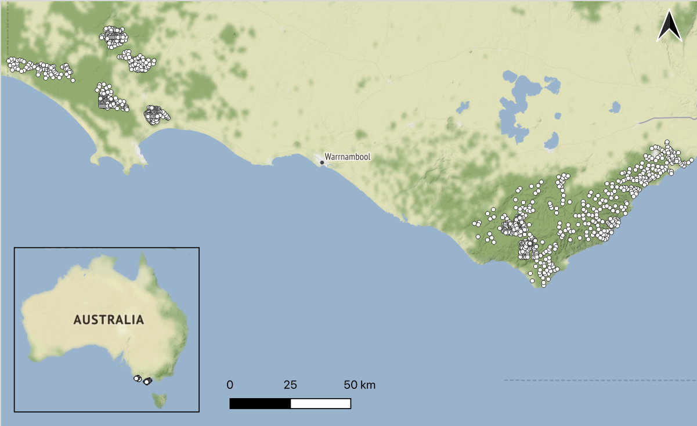
```

\newpage

# RESULTS

## Red fox

Foxes were detected in 1,453 of the 3,667 camera-traps surveys (39.6%; Supporting Information Table \@ref(tab:occ-naive)). The occupancy-detection model estimated that fox detectability was lower in landscapes with fox control; this effect was stronger in the Glenelg region than Otway Ranges (Supporting Information Fig. \@ref(fig:det-fc)). Foxes were also more detectable on camera-traps with a peanut butter lure than a tuna oil lure (Supporting Information Fig. \@ref(fig:det-lure)). Nonetheless, cumulative detection probabilities were universally high (\>75%) for the average survey duration (47 days). In the baited sites (where fox detectability was lower relative to unbaited sites), there was little difference in predicted site occupancy rates after accounting for imperfect detection relative to the naïve occurrence rate: 0.20 versus 0.23.  

The occupancy-detection model estimated fox occupancy to be lower at sites in baited landscapes than unbaited landscapes; this effect was more than twice as strong in the Glenelg region than the Otway Ranges (Supporting Information Fig. \@ref(fig:occ-fc)). For example, in heathy woodlands of the Glenelg region, fox occupancy probability was 0.56 (95% CI: 0.47 - 0.66) in unbaited landscapes and approximately three times lower in baited landscapes (0.19; 95% CI 0.13 - 0.26). In the heathy woodlands of the Otway Ranges, by comparison, fox occupancy was already low without fox control (0.33; 95% CI: 0.25 - 0.43) and was approximately 1.4 times lower with fox control (0.24; 95% CI 0.17 - 0.33). Foxes were ubiquitous across the study regions, but the probability of occupancy was nearly twice as high in dry forests, herb-rich woodlands and lowland forests than heathlands, heathy woodlands and wet forests (Supporting Information Fig. \@ref(fig:occ-veg)).

The GAM showed that fox-bait density in the Glenelg region was the strongest driver of fox occurrence. Fox occurrence in the Glenelg region declined from a probability of 0.68 (95% CI: 0.58 - 0.76) where fox-bait density was zero, to 0.04 (95% CI: 0.02 - 0.11) where fox-bait density was highest (1.14 baits km^-2^; Fig. \@ref(fig:gams-occ-fox)a). The effect of fox-bait density on fox occurrence in the Glenelg region was nonlinear: the probability of occurrence declined steeply between 0 and 0.3 baits km^-2^, there was little difference in fox occurrence across the range of 0.4 to 0.8 baits km^-2^, and greater suppression was again achieved at higher bait densities (Fig. \@ref(fig:gams-occ-fox)a). Fox occurrence also declined with fox-bait density in the Otway Ranges, but this effect was linear, weaker and had higher uncertainty (Fig. \@ref(fig:gams-occ-fox)a). In the Otway Ranges, fox occurrence declined from a probability of 0.40 (95% CI: 0.32 - 0.48) where fox-bait density was zero, to 0.14 (95% CI: 0.05 - 0.35) where fox-bait density was highest (1.1 baits km^-2^; Fig. \@ref(fig:gams-occ-fox)a).

There was no average TSF response on fox occurrence. Fox occurrence declined linearly with TSF in dry forests and increased linearly with TSF in heathland, although there was considerable uncertainty in these estimates (Fig. \@ref(fig:gams-occ-fox)g:h).

Fox occurrence declined linearly with increasing terrain ruggedness, and with distance to non-native vegetation for distances up to approximately 1.5 - 2.0 km (Fig. \@ref(fig:gams-occ-fox)d;f). Elevation had a nonlinear and uncertain effect on fox occurrence, which was estimated to peak around 450 m above sea level (Fig. \@ref(fig:gams-occ-fox)c). The effect of topographic wetness on fox occurrence was removed from the model, indicating that there was no support for this relationship (Fig. \@ref(fig:gams-occ-fox)e). The fox GAM that considered rainfall deviation in the previous six months was ranked more highly than models with 18- (by only 1.4 AIC units), 12-, and 24-month periods (by at least 6.4 AIC units; Table. \@ref(tab:occ-rain-aic)); however, this effect was weak with relatively high uncertainty (Fig. \@ref(fig:gams-occ-fox)c).

The top-ranked fox GAM had an adjusted R-square value of 0.27 and explained 26% of the null deviance. Relative to the null model (with only random intercept for site), the explanatory variables improved predictive performance considerably (242 AIC units lower), but slightly worsened the model fit (Table. \@ref(tab:occ-model-sumstats)).

## Feral cat

Cats were detected on 1,010 camera-trap deployments (27.6%; Supporting Information Table \@ref(tab:occ-naive)). Cats were relatively poorly detected in the Glenelg region, where they had a 59% probability of detection if they were present for the average survey duration, compared to 83% in the Otway Ranges; Supporting Information Fig. \@ref(fig:det-fc)). There was no strong difference in detectability between fox control treatment landscapes in either region (Supporting Information Fig. \@ref(fig:det-fc)). Cats were more detectable on camera-traps lured with tuna oil relative to peanut butter: for a 47-day survey duration in the unbaited landscapes of the Glenelg region, cats had a detection probability of 57% with peanut butter lures and 70% for tuna oil lures (Supporting Information Fig. \@ref(fig:det-lure)).

The occupancy-detection models estimated that cat occupancy in the Glenelg region was higher in landscapes with fox control (e.g., 0.25 in heathy woodlands; 95% CI: 0.16 - 0.35 in heathy woodlands) than those without fox control (0.12 in heathy woodlands; 95% CI: 0.07 - 0.19). In contrast, there was no association between cat occupancy and baiting in the Otway Ranges (Supporting Information Fig. \@ref(fig:occ-fc)). Cat occupancy was most strongly driven by vegetation type: it was highest in the wet forest, followed by heathland, swampy scrub, herb-rich woodland and dry forest, and very low in lowland forest and heathy woodland (Supporting Information Fig. \@ref(fig:occ-veg)).

The cat GAM showed no effect of fox-bait density, elevation or topographic wetness on cat occurrence (Fig. \@ref(fig:gams-occ-cat)a;c;e). Cats responded to TSF differently across each vegetation type, with the average TSF response removed from the model (Fig. \@ref(fig:gams-occ-cat)g:h). Cat occurrence probability increased with terrain ruggedness, and declined with distance from the nearest area of non-native vegetation, although uncertainty was high (Fig. \@ref(fig:gams-occ-cat)d;f). The different rainfall deviation windows were indistinguishable based on AIC scores; but in all cases except six months, the rainfall variable was removed from the model. The model that considered rainfall deviations in the previous six months was marginally top-ranked (by 0.7 AIC units) and estimated that cat occurrence slightly increased as rainfall increased relative to the long-term average (Fig. \@ref(fig:gams-occ-cat)c).

The top-ranked cat GAM had an adjusted R-square value of 0.24 and explained 24% of the null deviance. Relative to the null model, the explanatory variables improved predictive performance considerably (168 AIC units lower), but only slightly improved the model fit (less than 1% increase in null deviance explained and 0.02 for the R-squared value; Table. \@ref(tab:occ-model-sumstats)).

## Southern brown bandicoot

We detected SBBs on 394 of the 3,667 camera-traps (10.7%; Supporting Information Table \@ref(tab:occ-naive)). SBBs were highly detectable, with a greater than 95% detection probability reached after 31 and 43 survey days in the Glenelg and Otway Ranges, respectively (Supporting Information Fig. \@ref(fig:occ-fc)). Baiting was associated with a decrease in SBB detectability in Glenelg but an increase in detectability in the Otways (Supporting Information Fig. \@ref(fig:det-fc)). SBBs were slightly more detectable on camera-traps lured with peanut butter relative to tuna oil. However, neither baiting nor lure type had a meaningful effect on the culmulative detection probability across an average 47-day survey period (all probabilities greater than 95%; Supporting Information Fig. \@ref(fig:det-lure)).

There was no discernible effect of fox control on SBB occupancy in either region (Supporting Information Fig. \@ref(fig:occ-fc)). SBBs were most likely to occupy heathy woodlands (Supporting Information Fig. \@ref(fig:occ-veg)) and they were largely absent from wet forests (Supporting Information Table \@ref(tab:occ-naive)). The few SBB detections in wet forest occurred at sites adjacent to other vegetation types (SBBs are largely replaced by long-nosed bandicoots *Perameles nasuta* in wet forest; M. Rees, unpublished data).

SBB occurrence probability was very low. There was some indication SBB occurrence slightly increased with fox-bait density in the Glenelg region, peaked at around 150 m above sea level and 2 km from the nearest forest edge, and declined with increasing terrain ruggedness and TSF; however, these explanatory variables had high uncertainty relative to the strength of the effects (Fig. \@ref(fig:gams-occ-sbb)). There was no evidence that rainfall affected SBB occurrence -- the top-ranked models in terms of AIC scores had the effects of rainfall completely removed (Table. \@ref(tab:occ-rain-aic)).

The top-ranked GAMs for SBBs had an adjusted R-square value of 0.31 and explained 41% of the null deviance. Relative to the null model, the explanatory variables improved predictive performance considerably (211 AIC units lower) and slightly improved the model fit by 4% of null deviance explained and 0.05 for the R-squared value (Table. \@ref(tab:occ-model-sumstats)).

## Long-nosed potoroo

We detected LNPs on 331 camera-trap deployments (9%; Supporting Information Table \@ref(tab:occ-naive)). LNPs were the most detectable of our study species, with culmulative detection probabilities for the average 47-day survey period exceeding 95% for all baiting treatments, regions and lure types. The LNP daily detectability in the Glenelg region was twice as high in landscapes with fox control relative to those without (Supporting Information Fig. \@ref(fig:det-fc)). LNPs were slightly more detectable on camera-traps lured with peanut butter relative to tuna oil (Supporting Information Fig. \@ref(fig:det-lure)).

Occupancy of LNPs was highest in heathlands (Supporting Information, Fig. \@ref(fig:occ-veg)). The GAM showed that the probability of LNP occurrence improved from 0.05 (95% CI: 0.02 - 0.11) to 0.33 (95% CI: 0.16 - 0.55) across the fox-bait density gradient in the Glenelg region (Fig. \@ref(fig:gams-occ-lnp)a). In contrast, LNP occupancy showed no relationship with poison-bait density in the Otway region (Fig. \@ref(fig:gams-occ-lnp)a). LNP occurrence probability increased linearly with elevation (Fig. \@ref(fig:gams-occ-lnp)c) and peaked in the mid-range of topographic wetness (Fig. \@ref(fig:gams-occ-lnp)e). LNP occurrence was low initially after fire, but peaked around 20 years and remained steady in the years afterwards, although there was considerable uncertainty (Fig. \@ref(fig:gams-occ-lnp)e). There were no discernible differences in LNP responses to TSF across the vegetation types (Fig. \@ref(fig:gams-occ-lnp)f). The rainfall term was removed for the top-ranked model (at least 3.5 AIC units higher than models that included it).

The top-ranked model had an adjusted R-square value of 0.47 and explained 53% of the null deviance. Relative to the null model, the explanatory variables improved predictive performance (94 AIC units lower) and slightly improved the model fit by 3% of null deviance explained and 0.02 for the R-squared value (Table. \@ref(tab:occ-model-sumstats)).

\newpage

```{r gams-occ-fox, fig.cap="Generalised additive model estimates of the effect of each explanatory variable (columns) on red fox \\textit{Vulpes vulpes} occurrence. Shaded bands indicate 95\\% confidence intervals."}
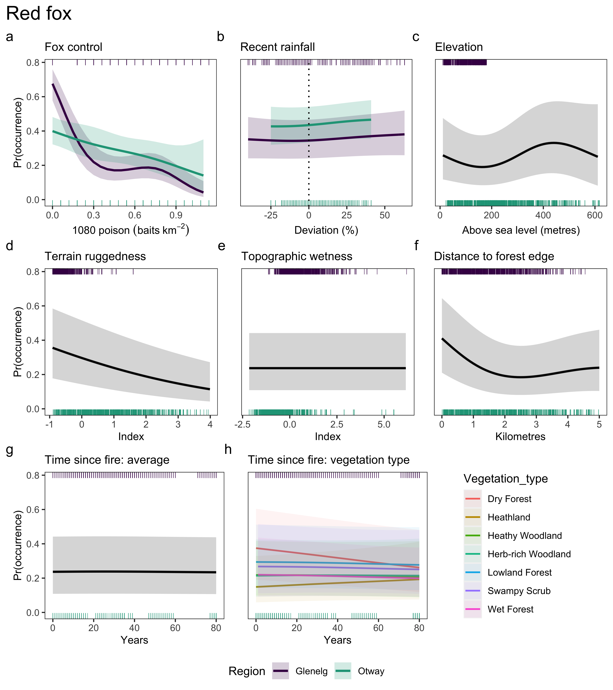
```

\newpage

```{r gams-occ-cat, fig.cap="Generalised additive model estimates of the effect of each explanatory variable (columns) on feral cat \\textit{Felis catus} occurrence. Shaded bands indicate 95\\% confidence intervals."}
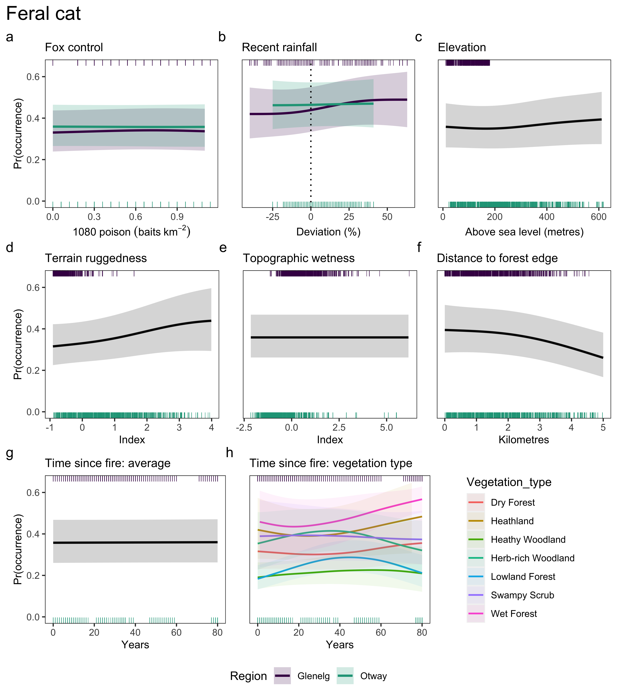
```

\newpage

```{r gams-occ-sbb, fig.cap="Generalised additive model estimates of the effect of each explanatory variable (columns) on southern brown bandicoot \\textit{Isoodon obesulus} occurrence. Shaded bands indicate 95\\% confidence intervals."}
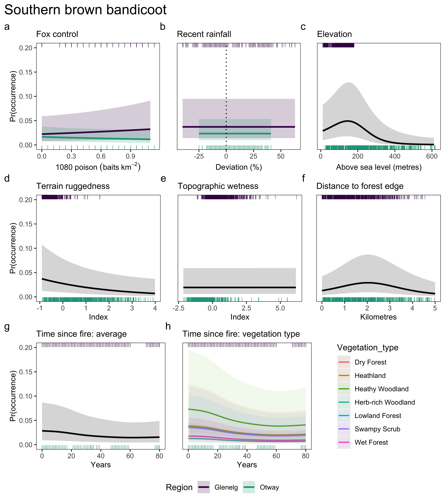
```

\newpage

```{r gams-occ-lnp, fig.cap="Generalised additive model estimates of the effect of each explanatory variable (columns) on long-nosed potoroo \\textit{Potorous tridactylus} occurrence. Shaded bands indicate 95\\% confidence intervals."}
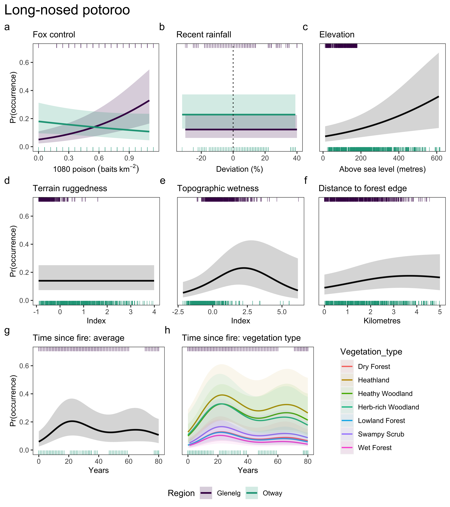
```

\newpage

# DISCUSSION

We found that consistent, long-term lethal control can reduce a widespread invasive dominant predator (fox) to a near-zero occurrence probability and--- importantly---increase the occurrence probability of a threatened prey species (LNP) more than 6-fold. However, prey responses to predator suppression are not universal [@sinclair1998predicting; @duncan2020eruptive]. Despite @robley2014long finding that SBB site occupancy increased in the early stages of the Glenelg Ark fox baiting program, we found little evidence that SBB occurrence increased with fox control in either region. This may have been because feral cat occurrence was slightly higher in the landscapes with fox control relative to those without in the Glenelg region, potentially signalling mesopredator release. In the Otway region (where fox control recently commenced and baiting was less frequent), foxes were suppressed to a lesser extent (as expected), neither threatened prey species nor cats showed signs of improvement. Our study reinforces that lethal invasive predator control can be a highly effective conservation strategy, but only for some species and when sustained continuously over the long-term.

The Glenelg Ark program has continuously controlled foxes across approximately 100,000 ha of public land since 2005 [@robley2014long] and is one of the few fox control programs in Australia to demonstrate a sustained reduction in fox occupancy [see also @stobo2020management]. Our study provides empirical evidence that the effectiveness of fox control from poison-baiting programs depends on the density of poison-baits deployed (Fig. \@ref(fig:gams-occ-fox)a). This has only previously been inferred by comparing fox baiting programs across different regions (where fox ecology, environmental conditions, and study designs, such as aerial and pulse-baiting, differ). The densities of poison-baits in our study regions (maximum 1.14 baits km^-2^) were far below the recommended 5 - 10 baits km^-2^ [mostly derived from studies in arid and semi-arid regions with different baiting regimes, @saunders2007improving], but nonetheless were effective at suppressing fox occurrence in the Glenelg region (Supporting Information Fig. \@ref(fig:occ-fc)). Increasing bait density up to 0.3 baits km^-2^ was particularly effective at controlling foxes in the Glenelg region, reducing fox occurrence by up to four-fold compared to unbaited regions; at higher bait densities, increasing poison-bait densities continued to increase suppression of foxes, but with a weaker rate of return (Fig. \@ref(fig:gams-occ-fox)a). Increased bait caching at high bait densities may explain why fox suppression tapered off, which is likely to result in a sublethal dose when eventually consumed and potential bait aversion [@saunders2007improving]. Nonetheless, benefits to threatened native prey is the best metric of fox control effectiveness. The probability of LNP occurrence increased linearly with poison-bait density in the Glenelg region (Fig. \@ref(fig:gams-occ-lnp)a), confirming that high fox control effort leads to improved conservation outcomes.

We slightly underestimated the effect of bait density across both regions because the models assumed all bait-stations were constantly active, despite some bait-replacements being missed due to wet weather events or more pressing management concerns (namely wildfire). Our estimates of species' responses to fox-baiting can therefore be considered conservative, given we modelled a more consistent control effort than actually happened. We more strongly underestimated the effect of bait density in the Otway Ranges because we also did not account for a near six-month pause in bait replacement in 2018. We also expect fox-baits to be less effective in the Otway Ranges than the Glenelg region due to the higher rainfall which more quickly degrades the poison [@gentle2007persistence; @saunders2000degradation]. Additionally, fox occupancy was already much lower in the Otway Ranges prior to fox control than in the unbaited landscapes of the Glenelg region, likely because the wetter conditions and more intact forest patches in the Otways provide less suitable fox habitat. Nonetheless, fox occupancy in the Otway Ranges was still negatively associated with fox-bait density (Fig. \@ref(fig:gams-occ-fox)a), suggesting that intense and sustained fox control is likely to be effective in that region. Future research will benefit from accounting for the role of prey availability and environmental conditions (e.g. the effects of soil wetness on bait degradation) on baiting effectiveness [@carter2013fox; @saunders2007improving], as well as baiting frequency and interference with baits by non-target species [@glen2003monitoring; @fairbridge2000observations; @marlow2015lethal].

Evidence that fox control caused mesopredator release of feral cats in terms of occupancy was mixed. Cat occupancy was higher in sites with fox control in the Glenelg region, but not the Otway Ranges (occupancy-detection model; Supporting Information Fig. \@ref(fig:occ-fc)). However, assuming perfect detection, cat occurrence did not change across gradients of poison-bait density in either region (GAM; Fig. \@ref(fig:gams-occ-cat)a). Cat detectability in the Glenelg region was particularly low, although there was no effect of fox-baiting on cat detectability (Supporting Information Fig. \@ref(fig:det-fc)a). This result could signal that cats respond to fox suppression at the landscape level rather than at finer spatial scales. In addition, potential changes in population density and behaviour following mesopredator release [@brashares2010ecological], such as cats reducing their ranging behaviour following fox control [as found by @molsher2017mesopredator and @rees2023mesopredator], could skew inference around occupancy estimates [@broadley2019density; @neilson2018animal; @mccarthy2013influence]. Cats had weak associations with most explanatory variables, the poorest detection rates and worst model fits of our study species, further highlighting the challenges of monitoring this elusive, generalist predator [@fisher2015cat; @stokeld2015multiple; @algar2020feral; @rees2019unexpectedly].

In the Glenelg region, LNP---but not SBB---occupancy improved with fox control (Supporting Information Fig. \@ref(fig:occ-fc)b). Using increases in prey occupancy to measure the effectiveness of predator control rests on the assumption that there is suitable habitat for prey to expand into. While SBBs had a narrower distribution relative to LNPs across our study regions (largely absent from wet forests), there were 34 heathy woodland sites in the Glenelg region where they were never observed (from 196 camera-trap deployments), suggesting there may have been suitable habitat for them to colonise. However, EVCs such as "heathy woodland" are a coarse, model-generated category; there may have been an environmental variable which precluded SBB presence at these 34 sites, such as local habitat structure [@swan2015predicting], although @smith2013fire found no association between habitat structure and SBB occupancy in the 240 Glenelg Ark monitoring sites. Alternatively, the different prey responses in our study could reflect the relative vulnerability of these species to fox and cat predation: LNPs (and other small macropods) appear more strongly limited by fox predation, whereas SBBs tend to be more closely associated with cat populations [@hunter2018not; @arthur2012relative] and so may have experienced negative consequences from higher cat occupancy and density [@rees2023mesopredator] in Glenelg landscapes with fox control. This would also help explain why SBB occupancy was highest in heathy woodlands, where cat occupancy was lowest (Supporting Information Fig. \@ref(fig:occ-fc)c). Formally testing whether invasive predator occupancy impacts the probability of prey occupancy using multispecies models [@rota2016multispecies] is a priority for future research.

In the Otway Ranges, fox control did not improve SBB or LNP occupancy (Supporting Information Fig. \@ref(fig:occ-fc); Fig. \@ref(fig:gams-occ-sbb)a; Fig. \@ref(fig:gams-occ-lnp)a). This is unsurprising given fox suppression in the Otway Ranges was weak, likely because fox control had only recently commenced and bait replacement was relatively inconsistent. Despite the high fecundity of these prey species, two years was may have been insufficient time to measure an effect of fox control on prey occupancy. Additionally, we averaged fox control effects over a 0 - 2 year post-baiting time period in the Otway Ranges; although, our findings concur with those of @robley2019otway, who estimated annual occupancy probabilities using a more traditional BACI analysis with a subset of this data. The ongoing broadscale monitoring of the Otway Ark fox control program and other local initiatives will better elucidate occupancy trends over time.

Fire can have long-term impacts on the occurrence of small-medium sized native mammals [@monamy2000small; @claridge2000factors; @arthur2012relative]. Previously, @smith2013fire found extinction probabilities for both LNPs and SBBs to be high for up to 18-months post-fire in the Glenelg region. Here we found that, LNP occurrence was low immediately post-fire and peaked 20 years post-fire (Fig. \@ref(fig:gams-occ-lnp)g). However, seemingly contrary to @smith2013fire, SBB occurrence declined with increasing TSF in our study (Fig. \@ref(fig:gams-occ-sbb)g). Given the uncertainty around our estimates and importance for managers implementing prescribed fire, further research is required to clarify and understand the mechanisms behind these responses to fire. A key remaining question is whether fox control impacts these species' responses to fire in the short and long-term.

While there is now considerable research which has demonstrated that invasive predator impacts are heightened in recently burnt areas [@hradsky2017human; @hradsky2017responses; @mcgregor2014landscape; @leahy2016amplified; @green2006immediate; @meek2000home; @mcgregor2016extraterritorial], we have a comparatively poor understanding of how long-term fire patterns impact invasive predators [reviewed in @hradsky2020conserving]. Similar to many previous studies, we found no average response to TSF for foxes or cats, however, both predators had varying responses to TSF across vegetation types (Fig. \@ref(fig:gams-occ-fox)g:h; Fig. \@ref(fig:gams-occ-cat)g:h). This is the first evidence of this kind for predators (albeit uncertainty around these relationships was high). Studies often merge similar vegetation types due to some groups having small sample sizes; however, we found no clear way of grouping vegetation types that was relevant to multiple species. Our hierarchical specification of the TSF and vegetation type interaction was powerful in this regard, as it allowed separate responses for each vegetation type, while sharing information across vegetation types, and provided confidence that there were data to back-up differently shaped responses given the penalisation to the average response [@pedersen2019hierarchical].

Accounting for other drivers of species in models that estimate responses to management is critical, but too rarely undertaken. For example, unexpected declines and local extinctions of small-medium sized mammals have occurred following 40 years of fox control in south-west Western Australia are posited to be the result of a mesopredator release of cats [@wayne2017recoveries], but the Intergovernmental Panel on Climate Change has identified this region as a 'drying hotspot' [@drying2021kala] and there are strong concerns around the intensity of prescribed fire operations [e.g., @bennett2021prescribed], offering alternative or contributing explanations for prey declines. Mammal communities have also collapsed following long-term fox-control in Booderee National Park [@lindenmayer2018conservation], but a severe wildlife burnt through approximately half the region in the same year fox control commenced [leaving greater than 73% of park burnt within the last decade, @foster2017effects]. Similarly, recent fire events have been skewed towards the baited landscapes of the Glenelg region since fox control began, with the majority of long-unburnt vegetation occurring in unbaited landscapes (Fig. \@ref(fig:veg-tsf-violin)). We were partially able to compensate for this confounding by including an additional 424 sites in the Glenelg region, as well as the Otway Ranges datasets---providing a wider range of fire history patterns in each vegetation type with and without fox control (Fig. \@ref(fig:veg-tsf-violin)). Our study demonstrates the value of bringing together multiple smaller datasets to compare management effectiveness.

Fox control is a major expenditure of Australian conservation and agricultural programs [approximately AUD 16 million annually, @mcleod2004counting]. It is critical to ensure cost-effectiveness from both a monetary and ethical standpoint. Here we demonstrate a clear relationship between control effort and effectiveness in terms of fox suppression. However, the evidence for benefits to native prey species was mixed. Native prey species may not benefit from invasive predator control if the suppression of one invasive species leads to mesopredator release of other predators, or if prey are constrained by other factors such as lack of suitable habitat. Many species that are vulnerable to fox predation are also sensitive to fire-induced changes in habitat structure [@woinarski2015ongoing], and so integrating conservation strategies to consider habitat and invasive predator management in concert is a priority. Our work highlights the importance of fine-scale monitoring, considering multiple drivers and tailoring conservation strategies to local contexts.

\newpage

# ACKNOWLEDGEMENTS {.unnumbered}

We acknowledge and pay respects to the Gunditjmara and Eastern Maar peoples on whose traditional lands this study took place. We thank the Department of Environment, Land, Water, and Planning (DELWP) Heywood team and Parks Victoria West Coast District Team for sharing camera-trapping datasets. The M.W.R PhD surveys were conducted with the assistance of many fieldwork volunteers, under the University of Melbourne Animal Ethics Committee approval 1714119.5 and Victorian Government Department of Energy, Environment and Climate Action Research Permit 10008273. This study was generously supported by the Conservation Ecology Centre, the Victorian Government Department of Energy, Environment and Climate Action, Parks Victoria, Holsworth Wildlife Research Endowment -- Equity Trustees Charitable Foundation and Ecological Society of Australia, Australia Government through the National Environmental Science Program's Threatened Species Recovery Hub, and Australian Research Council Linkage Project LP170101134. M.W.R also received funding from an Australian Government Research Training Program Scholarship and a Victorian Government DELWP top-up scholarship.

\newpage

# REFERENCES {.unnumbered}

::: {#refs}
:::

\newpage

# Funding {.unnumbered}

This study was generously supported by the Conservation Ecology Centre, the Victorian Government DELWP, Parks Victoria, Holsworth Wildlife Research Endowment -- Equity Trustees Charitable Foundation and Ecological Society of Australia, the Australia Government through the National Environmental Science Program's Threatened Species Recovery Hub, and Australian Research Council Linkage Project LP170101134. M.W.R also received funding from an Australian Government Research Training Program Scholarship and a Victorian Government DELWP top-up scholarship.

# Competing Interests {.unnumbered}

The authors have no relevant financial or non-financial interests to disclose.

# Author contributions {.unnumbered}

All authors contributed to the study conception and design. Material preparation and analysis were performed by Matthew Rees. Matthew Rees, Alan Robley, Jack Pascoe, Mark Pla, Emma Birnbaum and Bronwyn Hradsky contributed to the data collection. The first draft of the manuscript was written by Matthew Rees and all authors commented on previous versions of the manuscript. All authors read and approved the final manuscript.

# Data availability {.unnumbered}

<https://github.com/matt-w-rees/sw-vic-occurrence-phd>

```{=tex}
\newpage
\beginsupplement
\setcounter{page}{1}
```
# SUPPORTING INFORMATION {.unnumbered}

```{r clean-records}

## DATA PREPARATION
records <- read.csv("/Users/ree140/Dropbox/personal/matt/github/phd-thesis/index/data/occ/records_presence_absence.csv")
# drop zoi's records - too much spatial autocorrelation
records <- filter(records, data_source != "zoi")
# exclude stations left out for less than 14 days
records <- filter(records, survey_duration >= 10)
# as we only had three "Riverine Grassy Woodlands or Forests" unique survey sites --> drop em
records <- filter(records, XGROUPNAME != "Riverine Grassy Woodlands or Forests")
# as we only had 20 "Rainforests" unique survey sites, all of which interspersed in "Wet Forests" in the Otways, reclassify as "Wet Forests". 
records$XGROUPNAME <- if_else(records$XGROUPNAME == "Rainforests", "Wet or Damp Forests", as.character(records$XGROUPNAME))
# abbreviate EVC group names for plotting
records$XGROUPNAME <- if_else(records$XGROUPNAME == "Wet or Damp Forests", "Wet Forests", records$XGROUPNAME)
records$XGROUPNAME <- if_else(records$XGROUPNAME == "Riparian Scrubs or Swampy Scrubs and Woodlands", "Swampy Scrubs", records$XGROUPNAME)
records$XGROUPNAME <- substr(records$XGROUPNAME, 1, nchar(records$XGROUPNAME) - 1)

```

```{r cam-stats-glenelg}
table2 <- records %>%
  mutate(block = ifelse(block == "south", "FA3", 
                        ifelse(block == "north", "FA4", block))) %>%
  group_by(region, block, year(date_start)) %>%
  transmute(sites = length(unique(station)),
            treatment,
            fox_control = ifelse(max(foxbaits) < 7 & treatment == "treatment" | (block == "FA1" & year(date_start) == 2016), "no", 
                                 ifelse(max(foxbaits) > 7 & treatment == "treatment", "yes", "NA")),
            date_start = min(date_start), 
            date_end = max(date_end),
            average_survey_duration = round(mean(survey_duration), digits = 0)) %>%
  ungroup() %>%
  distinct() %>%
  arrange(region, block, treatment, date_start)

# make table
kbl(filter(table2, region == "glenelg") %>% select(!c(region, fox_control)),  booktabs = T, digits = 2, linesep = "",
    caption = "Functional camera-trap survey summary statistics in the Glenelg region where foxes are controlled across some forest blocks (treatment) but not in other, similar forest blocks (non-treatment).",
    col.names = c("Forest block", "Year", "Sites", "Treatment", "Start date", "End date", "Mean survey duration")) %>% 
   kable_styling(latex_options = c("repeat_header","scale_down")) 
```

\newpage

```{r cam-stats-otways}
# make table
kbl(filter(table2, region == "otways") %>% select(!c(region)), longtable = T, booktabs = T, digits = 2, linesep = "",
    caption = "Functional camera-trap survey summary statistics in the Otway Ranges where foxes are controlled across some forest blocks (treatment) but not in other, similar forest blocks (non-treatment). Fox-baiting had occurred in small section of the 'FA1' forest block since 2008, extending to across the remainder of the block in September 2018 (here we summarise this as treatment not started, although this was accounted for in the models). Fox-baiting commenced for the first time in 'FA2' and 'FA3' forest blocks in November 2017.",
    col.names = c("Forest block", "Year", "Sites", "Treatment", "Treatment started?", "Start date", "End date", "Mean survey duration"))
```

\newpage

```{r occ-naive}

# SUMMARIES
table1 <- records %>%
  group_by(region, XGROUPNAME) %>%
  mutate(sites = length(unique(station)),
         deployments = length(unique(station_year)),
         fox_present = sum(fox),
         cat_present = sum(cat),
         sbb_present = sum(bandicoot_sb),
         lnp_present = sum(potoroo_ln),
         fox_naive = (fox_present / deployments),
         cat_naive = (cat_present / deployments),
         sbb_naive = (sbb_present / deployments),
         lnp_naive = (lnp_present / deployments)
         )
table1 <- table1 %>%
  dplyr::select(XGROUPNAME, region, sites, deployments, fox_naive, cat_naive, sbb_naive, lnp_naive)  %>% 
  distinct() %>%
  arrange(XGROUPNAME, region)
# rename region 
table1$region <- factor(table1$region)
levels(table1$region) <- c("Glenelg", "Otway")

# remove repeat vegetation name
table1[c(2, 4, 6, 8, 10, 12),1] <- ""

# make table
kbl(table1, longtable = T, booktabs = T, digits = 2,
    caption = "Number of camera-trap sites, total deployments and naive occupancy rates for red foxes, feral cats, southern brown bandicoots (SBB) and long-nosed potoroos (LNP) within Ecological Vegetation Class groups across two broad regions in south-west Victoria, Australia.",
     col.names = c("Vegetation", "Region", "Sites", "Deployments", "Fox", "Cat", "SBB", "LNP")) %>% 
   kable_styling(font_size = 10)
```

\newpage

```{r veg-tsf-violin, fig.cap="Range and distribution of time since fire values across the surveyed vegetation types in baited and unbaited sites. In the Glenelg Ark camera-trapping dataset, where most sites in the baited landscapes are relatively recently burnt, and most sites are long-unburnt in the unbaited landscapes. Combining M.W.R PhD and Otway Ark surveys provides a wider range of fire history patterns in each vegetation type with and without fox control."}
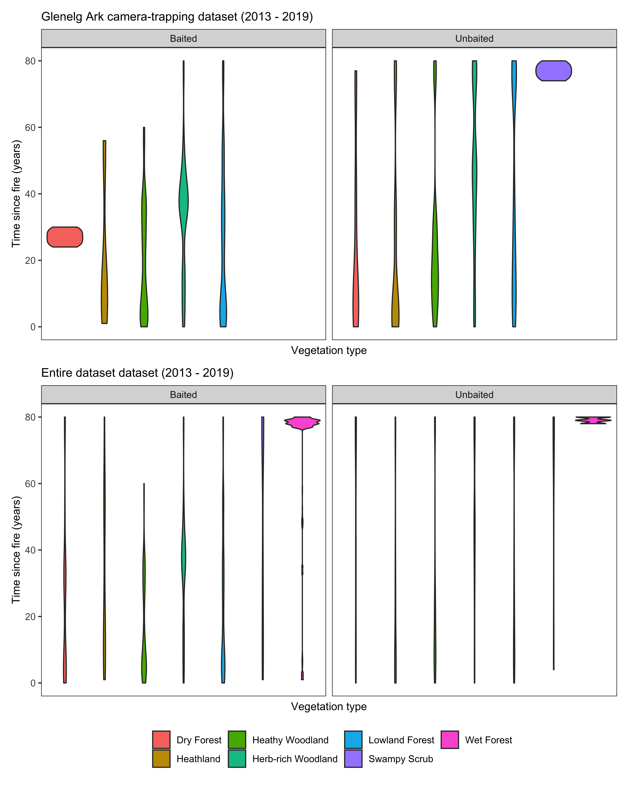
```

\newpage

```{r det-lure, fig.cap="Cumulative detection probabilities of species using camera-traps lured with peanut butter, rolled oats and golden syrup (red) mechanics cloth soaked in tuna oil (blue) in south-west Victoria, Australia. Vertical grey lines represent mean (solid) as well as 25\\% and 75\\% quantiles (dotted) of days camera-traps were active for. Shaded bands represent 95\\% Bayesian credible intervals. Estimates were derived from Bayesian occupancy-detection models, using unbaited Glenelg landscapes as a reference level."}
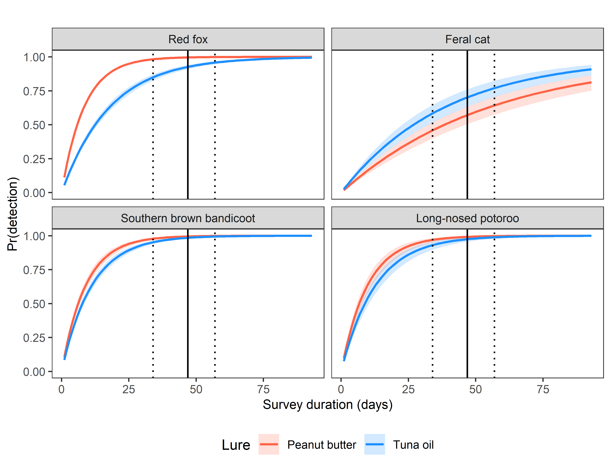
```

\newpage

```{r det-fc, fig.cap="Cumulative detection probabilities of species in landscapes with fox control (red) and without fox control (blue) in the Glenelg region (a) and Otway Ranges, south-west Victoria, Australia. Fox control had occurred in The Glenelg region for 8 - 13 years and was monitored with a control-impact design. The Otway Ranges was monitored using a before-after-control-impact experimental design; surveyed approximately 1 year prior and 2 years following the commencement of fox-baiting. Vertical grey lines represent mean (solid) as well as 25\\% and 75\\% quantiles (dotted) of days camera-traps were active for. Shaded bands represent 95\\% Bayesian credible intervals. Estimates were derived from Bayesian occupancy-detection models."}
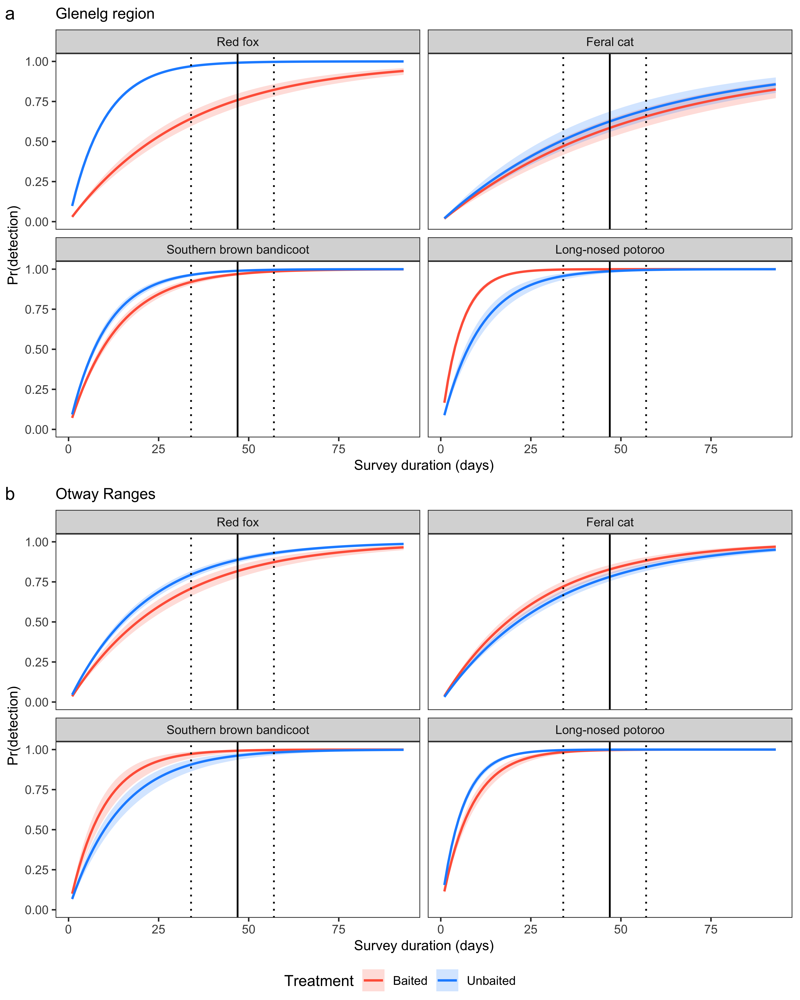
```

\newpage

```{r occ-fc, fig.cap="Occupancy estimates of species in landscapes with fox control (red) and without fox control (blue) in the Glenelg region and Otway Ranges, south-west Victoria, Australia. Fox control had occurred in The Glenelg region for 8 - 13 years and was monitored with a control-impact design. The Otway Ranges was monitored using a before-after-control-impact experimental design; surveyed approximately 1 year prior and 2 years following the commencement of fox-baiting. Occupancy was also modelled as a function of vegetation type (Ecological Vegetation Class groups; here we used 'Heathy Woodlands' as a reference level). Error bars represent 95\\% Bayesian credible intervals. Estimates were derived from Bayesian occupancy-detection models."}
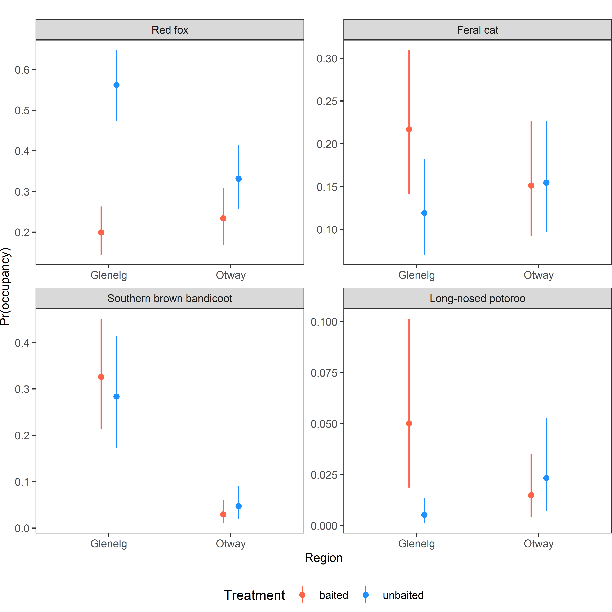
```

\newpage

```{r occ-veg, fig.cap="Occupancy estimates of species across different vegetation types (Ecological Vegetation Class groups) in south-west Victoria, Australia. Error bars represent 95\\% Bayesian credible intervals. Estimates were derived from Bayesian occupancy-detection models."}
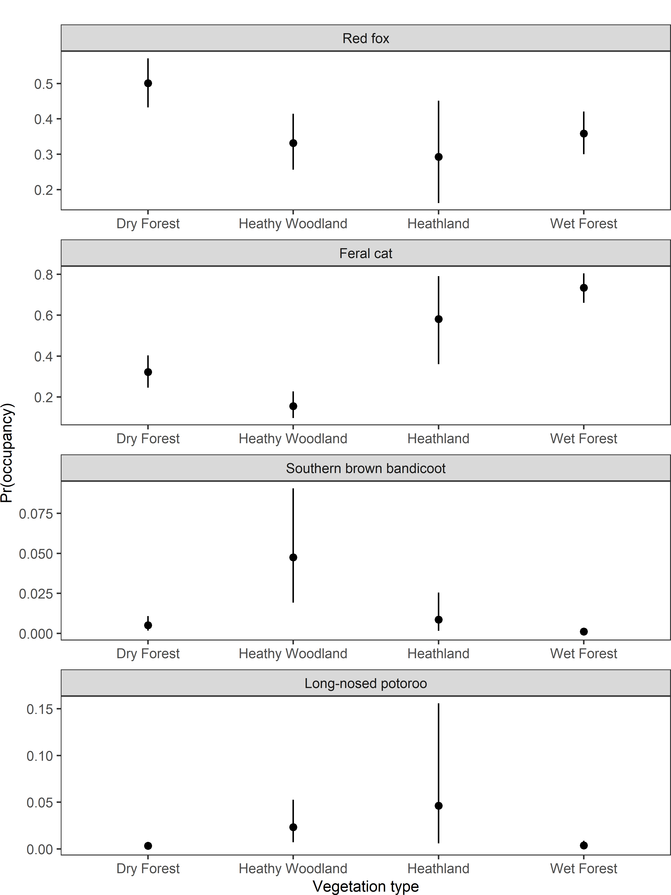
```

\newpage

```{r occ-rain-aic}

df <- read_csv("/Users/ree140/Dropbox/personal/matt/github/phd-thesis/index/data/occ/rain_occ_aic_table.csv") %>%
  dplyr::select(-c(df, ...1)) %>% 
  arrange(match(species, c( "fox", "cat", "SBB", "LNP")), desc(species))
# rename
df$species <- c(rep("Red fox",4), rep("Feral cat",4), rep("Southern brown bandicoot",4), rep("Long-nosed potoroo",4))

# make table
kbl(df, longtable = T, booktabs = T, digits = 2, 
    caption = "Akaike's Information Criterion values for generalised additive models with different rainfall periods.",
     col.names = c("Species", "Months", "AIC", "dAIC"))  %>% 
   kable_styling(font_size = 10) %>% 
  footnote(general = c("AIC - Akaike's Information Criterion score",
                     "dAIC - difference between AIC of this model and the model with smallest AIC"))

```

\newpage

```{r occ-model-sumstats}

df <- read_csv("../derived_data/model_summaries.csv") %>%
  dplyr::select(-c(...1)) 
# rename
df$species <- c(rep("Red fox",2), rep("Feral cat",2), rep("Southern brown bandicoot",2), rep("Long-nosed potoroo",2))

# make table
kbl(df, longtable = T, booktabs = T, digits = 2, 
    caption = "Generalised additive model summary statistics for models with 'full' set of explanatory variables relative to a 'null model' with only a site random effect.",
     col.names = c("Species", "Model", "EDF", "dev.expl", "r.sq", "AIC"))  %>% 
   kable_styling(font_size = 10) %>% 
  footnote(general = c("EDF - estimated degrees of freedom of all model terms.",
                       "dev.expl - proportion of the null deviance explained by the model. ",
                       "r.sq -  adjusted r-squared value.",
                      "AIC - Akaike's Information Criterion score"))

```

\newpage

```{r occ-tsf, fig.cap="Time since fire had a weak impact on fox (a) and feral cat (b) occupancy probability in south-west Victoria, Australia. Southern brown bandicoot occupancy probability (c) peaked around 15 and 75 years following fire, although, the magnitude of both peaks differed across Ecological Vegetation Class groups. Long-nosed potoroo occupancy probability (d) linearly increased with time since fire in heathy vegetation groups, but linearly decreased with years post-fire in Herb-Rich Woodlands. Estimates derived from generalised additive models (assuming perfect detection). Shaded regions indicate 95\\% confidence intervals. Rug ticks representing the distribution of time since fire data for the Glenelg region (brown) is shown on the inside of the top axis, Otway Ranges distribution shown on the inside of the bottom axis (navy)."}
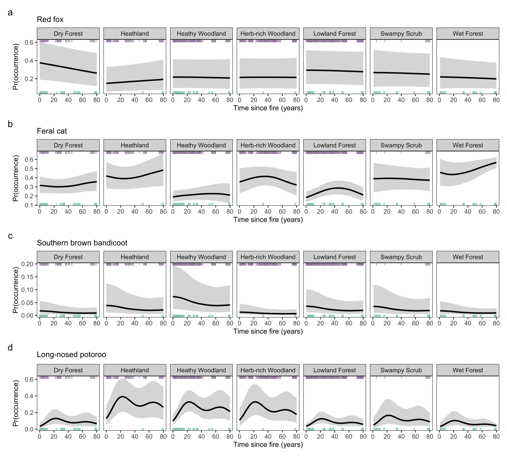
```
